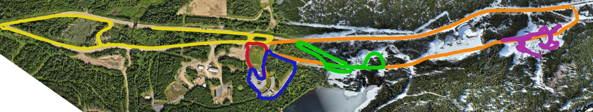

[](https://github.com/astral-sh/ruff)


# FoMo SDK
A public SDK for the FoMo dataset for autonomous driving in multiseasonal conditions

This repository is work in progress.

Installation (assuming you have [uv installed](https://docs.astral.sh/uv/getting-started/installation/))

```bash
uv venv
source .venv/bin/activate
uv sync
```

Navigate to `examples` to see how to use the SDK in example jupyter notebooks.

#### Multi-season evaluation
Check [fomo-bench](https://github.com/norlab-ulaval/fomo-bench/tree/ros2) for FoMo multi-seasons localization evaluation.
